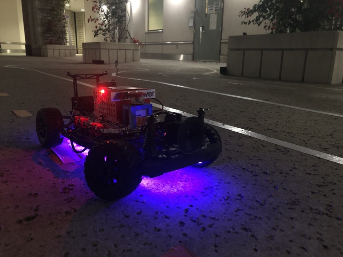
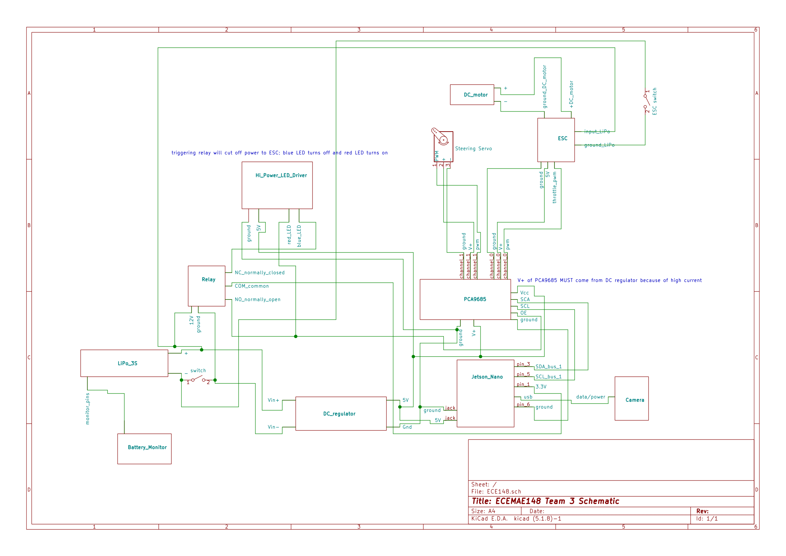

# potatoInside

A ROS package using OpenCV on an RC car to do autonomous laps around a track using line following algorithms.

  
  

## Table of Contents

- [potatoInside](#potatoinside)
  - [Table of Contents](#table-of-contents)
  - [Wiring Schematic](#wiring-schematic)
  - [Dependencies](#dependencies)
    - [cv2](#cv2)
    - [adafruit_servokit](#adafruit_servokit)
    - [cv_bridge](#cv_bridge)
    - [simple-pid](#simple-pid)
  - [Structure](#structure)
    - [Nodes](#nodes)
      - [**throttle_client**](#throttle_client)
      - [**steering_client**](#steering_client)
      - [**camera_server**](#camera_server)
      - [**lane_detection_node**](#lane_detection_node)
      - [**lane_guidance_node**](#lane_guidance_node)
    - [Calibration](#calbration)
  - [Topics](#topics)
  - [Issues and Fixes](#issues-and-fixes)

## Wiring Schematic

## Dependencies

### [cv2](https://opencv.org/)

Description TBD

### [adafruit_servokit](https://circuitpython.readthedocs.io/projects/servokit/en/latest/)

### [cv_bridge](http://wiki.ros.org/cv_bridge)

Description TBD

### [simple-pid](https://pypi.org/project/simple-pid/)

Description TBD

## Structure

### Nodes

#### **throttle_client**

Associated file: throttle_client.py

This node subscribes to the [throttle](#Topics) topic. We use subscriber callback function
to validate and normalize throttle value, and then use the [adafruit_servokit](#adafruit_servokit)
module on **channel 0** for sending signals to the hardware.

This node is also responsible for reading and setting the throttle calibration values.

#### **steering_client**

Associated file: steering_client.py

Similar to [throttle_client](#throttle_client), this node subscribes to the [steering](#Topics)
topic and pass the signals to the hardware. The steering servo is on **channel 1**.

#### **camera_server**

Associated file: camera_server.py

This node simply reads from the camera with cv2's interface and publish the image to the
[camera_rgb](#Topics) topic.

#### **lane_detection_node**

Associated file: lane_detection.py

In this node, we read from [camera_rgb](#Topics) topic and use opencv to identify line
information from the image, and publish the information of the middle point between
all identified lines to the [centroid](#Topics) topic.

#### **lane_guidance_node**

Associated file: lane_guidance.py

This node subscribes to the [centroid](#Topics) topic, calculates the throttle and steering
based on the centroid value, and then publish them to their corresponding topics.

Throttle is based on whether or not a centroid exists - car goes faster when centroid is present and slows down when there is none.

Steering is based on a PID controller implemented by the [simple-pid](#simple-pid) module. Gains can be tweaked in the **lane_guidance.py** script.

## Calibration

## Topics

| Name       | Msg Type              | Info                                                       |
| ---------- | --------------------- | ---------------------------------------------------------- |
| throttle   | std_msgs.msg.Float32  | Float value from -1 to 1 for controlling throttle          |
| steering   | std_msgs.msg.Float32  | Float value from -1 to 1 for controlling steering          |
| camera_rgb | sensor_msgs.msg.Image | Image last read from USB camera image                      |
| centroid   | std_msgs.msg.Int32    | Integer for x coordinate of centroid in camera image space |

## Issues and Fixes

### **Error with CV_Bridge conversion from Image message to OpenCV image**

Using **bridge_object.imgmsg_to_cv2()** threw errors on our Jetson Nano environment, so we had to resort to our own image decoder function. Function **decodeImage()** can be imported from **decoder.py**. If you don't want to use our function, the problem can be avoided by properly building CV_Bridge with Python3 in the ROS package.

### **Throttle not working**

This issue can vary between cars, but generally the problem lies in the PWM range that is mapped by the Adafruit library. If the "start" PWM is too low, then even a maxed out "1" might not map to the PWM value that will trigger the ESC. First make sure the -1 to 1 range is properly calibrated. During runtime, the scale constant found in **throttle_client.py** can also be tweaked.

### **cv2 thesholding not picking up road lines**

This issue stems from two sources that are not mutually exclusive:

It can be that the lower and upper HSV ranges configured in **lane_detection.py** are not properly recognizing the color of whatever marks you are trying to parse on your road environment. This can be done through trial and error or by using online color pickers.

Most USB cameras have minds of their own. Essentially, it can do its own processing independent from cv2 like constrast, saturation, and more importantly auto exposure. Adapting to the ambient light means certain HSV ranges may not apply when lighting changes, messing up algorithms. To combat this, you would need to configure your USB camera to manual exposure, ensuring that your HSV range is consistent everywhere. To do this, follow <a href="https://www.kurokesu.com/main/2016/01/16/manual-usb-camera-settings-in-linux/">this</a> page for more information on how to access camera variables via Linux terminal.

